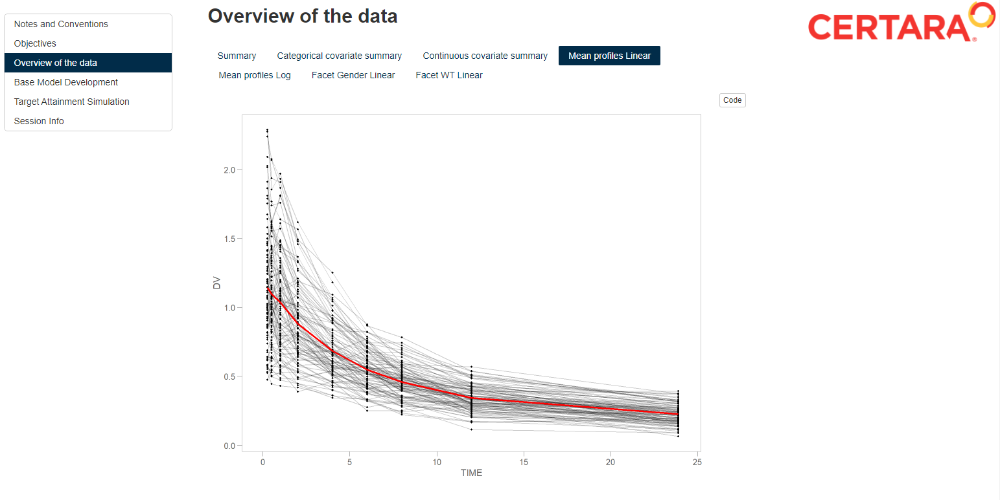

# RsNLME-Rmd-Report-Example

----

An example of how to use RsNLME with R Markdown to efficiently prepare a report.  Click [here]("BaseModelSummary.html") to view example report.



## Requirements

In order to execute the following example you must have installed:

* Certara.RsNLME v1.1.0
* NLME Engine v21.11.1

Click [here](https://certara.github.io/R-RsNLME/articles/installation.html) for installation details. Visit the [`Certara.R` website](https://certara.github.io/R-Certara/) for more information about R packages developed by Certara.

## Usage

After cloning the repository, open `RsNLME-Rmd-Report-Example.Rproj` in RStudio, execute the following command to render the R Markdown file to `html` output.

``` r
library(rmarkdown)

html_output_file <- render("BaseModelSummary.Rmd")

browseURL(html_output_file)
```

*Note: You may receive a notification in RStudio about missing packages required to execute the R Markdown file. Click the* **install** *button in RStudio to install any missing dependencies.*
